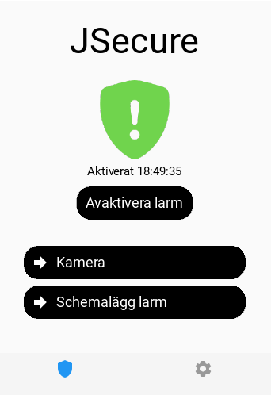
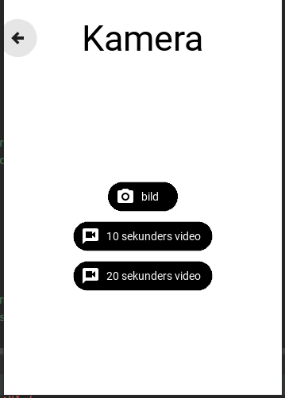
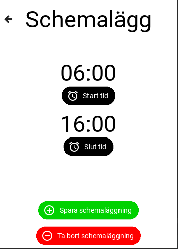

# HomeAlarm
 
An alarm for my home was created using a Raspberry Pi Zero 2W and a 3D-printed case. 
For a functioning alarm an app was also created to Android which has a neat interface
for functionalities such as scheduling, requesting pictures or video and also turning on and off the alarm.

##### Different screens

 

 

##### Module 

 

## How it works
The mobile app was created using Kivy and to allow communication between the phone and RPi I used mongoDB to update certain important information.
The RPi uses openCV computer vision for detecting any humans using a cascade classifier. The RPi system also has certain fail-safes in case the power would go out
in which the script will start itself upon re-gaining power, also if it fails to access the camera in a certain instance it will skip that iteration and notify the user.