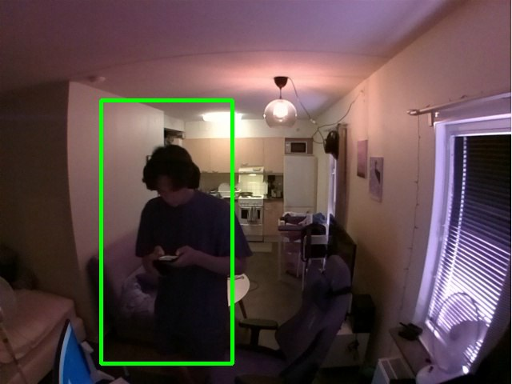
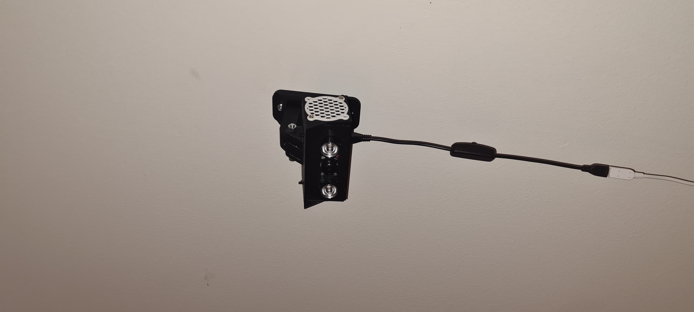
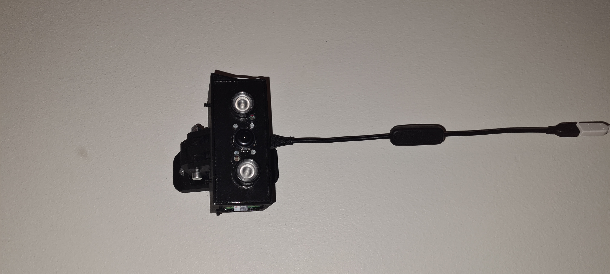

# HomeAlarm
 
An alarm for my home was created using a Raspberry Pi Zero 2W and a 3D-printed case. A complementary app was also developed for Android, featuring a neat interface that allows for functionalities such as scheduling, requesting pictures or videos, and turning the alarm on and off.

##### Different screens

 

 

##### Module 

 

## How it works
The mobile app was created using Kivy, and MongoDB was utilized to facilitate communication between the phone and the Raspberry Pi (RPi), enabling updates to certain important information. The RPi employs OpenCV computer vision to detect humans using a cascade classifier. Additionally, the RPi system includes specific fail-safes; for example, if the power goes out, the script will restart itself upon regaining power. If the system fails to access the camera at a particular instance, it will skip that iteration and notify the user.
